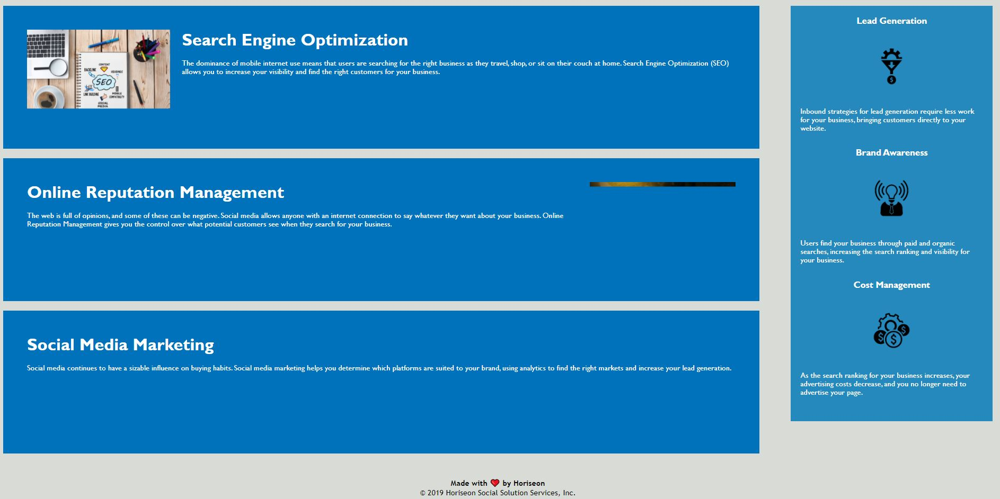

# Refactoring Code
---
## Description
This project was to understand the pre-written code more fully, make the organization of the code better, and add comments to allow other readers to understand the code.

<a href="https://courtbourt12.github.io/Homework-1-Refactoring/">Click here to go to the deployed project</a>

 
 

 
 

## Table of Contents
    - Installation
    - Usage
    - License
    - Contributing
    - Tests
    - Questions

## Installation
Clone the gitbash repository link.

## Usage
You can just click on the deployed link and filter through the website.

## License
license used : MIT License

 

<a href="https://opensource.org/licenses/MIT">Click here for license info.</a>

## Contributing
Whoever wrote this first and then me who added some comments.

## Tests

No tests created.

 

--- 

 

## Questions

If you have any questions, feel free to contact me:
<ul>
<li> Github : <a href="https://github.com/courtbourt12">Click here to go to my GitHub page.</a> </li>
<li> Email : courtneylong877@gmail.com </li>
</ul>
